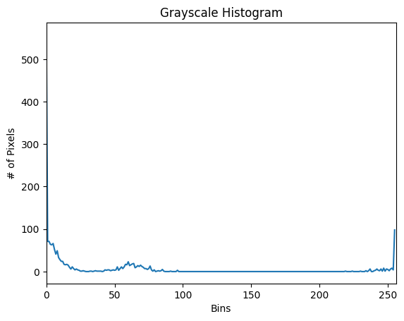
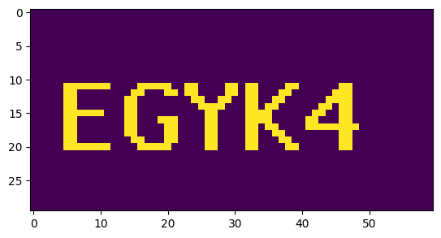
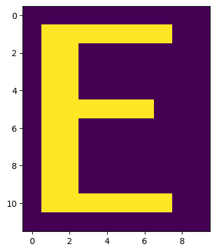
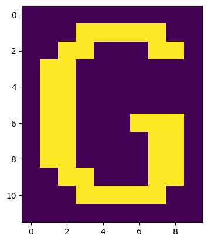
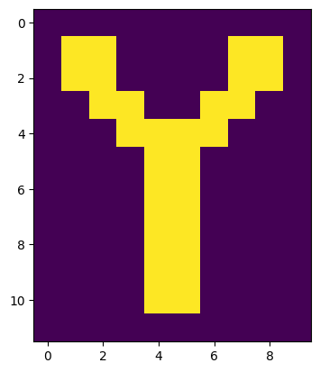
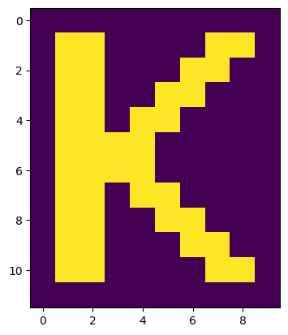
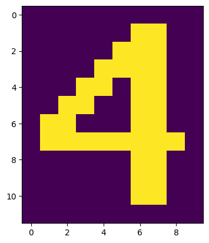
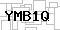

# Captcha solver using OpenCV

## Introduction
This challenge involves creating a simple AI model or algorithm to recognize captchas generated by a website. Computer Vision techniques including thresholding, contour finding and Hu moments are used in this project. 

## Dataset
The images are stored in this [input folder](sampleCaptchas/input) and their corresponding text are stored in [output folder](sampleCaptchas/output).

The captcha images share the following characteristics:

- The number of characters remains constant in each captcha.
- Font and spacing are consistent across captchas.
- Background and foreground colors and textures are largely the same.
- The structure of characters is not skewed.
- Each captcha consists of exactly 5 characters, with characters being either - uppercase letters (A-Z) or numerals (0-9).

An example image is as follow:

## Approach
### Data Exploration

The colour intensity of the background noise in the captcha image is lower than that of the actual text. Therefore, each image can be converted to grayscale and thresholding applied to segregate the captcha text from the background noise. 

To determine the threshold value, a histogram is plotted based on the pixel intensity values for all captcha images. 

From the above plot, we observe that the background pixel intensities are below 150, hence that will be used as the threshold criteria. 

### Data Proprocessing
Image after thresholding:

For character identification, `cv2.findContours` and `cv2.boundingRect` method is used to obtain the region of interest for each character in the captcha. This region of interest will be used to crop the characters for further processing. 

### Model Development
 Hu Moments, also known as image moments or shape moments, are a set of mathematical descriptors used for shape analysis in image processing and computer vision. They were introduced by M. Hu in 1962 and are designed to be invariant to translation, rotation, and scale changes, making them particularly useful for characterizing the shape of objects in images.

Due to the robustness of Hu moments to translation, this algorithm is used to extract essential shape features for text recognition. Since the dataset contains all uppercase letters (A-Z) and numerals (0-9), we are able to capture Hu moments of all required shapes for text recognition. 

To evaluate Hu moments for each image, `cv2.HuMoments` is applied to every image containing a letter. 

    {'E': [0.0016687419930316927,  6.904270649956374e-07,  2.3576347226255613e-10,    2.0902198491516978e-10,    -4.39080274684005e-20,
    -1.66035812051066e-13,    1.5004223640818668e-20]}

### Results

For characters that appear more than once in the dataset, the Hu moments of these repeated characters are verified to be identical using Euclidean distance. This validates the robustness of the algorithm in obtaining unique shape features for each character. 

Furthermore, the algorithm is run on an unseen image `input100.jpg` and successfully obtained the correct result. 

## Files

[main.ipynb](./main.ipynb) - Data Preprocessing and Model Development

[hu_moments_values.json](./hu_moments_values.json) - Hu moments for each character from A-Z and 0-9

[Captcha.py](./Captcha.py) - Inference code

